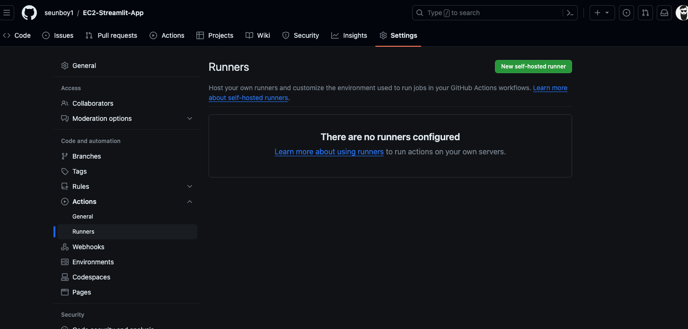

# EC2-Streamlit-App
This is a simple project that shows how to deploy a GPT-3 app built with Streamlit on an AWS EC2 instance using Github Actions as CI/CD pipeline. 

<br/>


## Steps to deploying

1. Connect to your ec2 instance
    ```bash
        ssh -i "testkey.pem" ubuntu@ec2-52-202-251-189.compute-1.amazonaws.com
    ```

2. Setup python virtual environment - run these commands:
    ```bash
        apt install python3.10-venv 
        python3 -m venv ~/.[name] # create python VE
        source ~/.[name]/bin/activate #activate
    ```
3. git clone this repo
    ```bash
        git clone https://github.com/seunboy1/EC2-Streamlit-App.git
    ```
4. Install necessary libraries
    ```bash
        pip install -r requirements.txt
    ```
5. Permanently store your openai secret key as environment variable in ec2 
    ```bash
        vim ~/.bashrc
        export openai_key=your key
    ```
   Nt: you have to reconnect to your ec2 instance to see the changes.
6. Edit the security group of your ec2 to add an inbound rule for port 8501, since streamlit uses the 8501 port.
   
7. Run streamlit app in background
    ```bash
        nohup streamlit run app.py &
    ```
8. Check out the app
   ```bash
        http://[your public ipv4 address]:8501
        http://52.201.250.185:8501
    ```
9.  To take it a step further you can deploy it with a custom domain. Check out this [repo](https://github.com/seunboy1/Static-Website) on how to do it.

## CI/CD with Github Actions

1. To connect to EC2 instance, you need to install and configure Git Action Runner on our AWS EC2 instance. To download and configure a Git Action Runner on our EC2 instance:
   1. Go to the GitHub repository and click on Settings.
   2. On the left-hand sidebar, click on Actions then select Runners.
   3. In the Runners page click on the New self-hosted runner button.
        
   4. Then step by step, run the commands shown in the New self-hosted runner  page in your ec2 terminal
   5. Next, install a service to run the runner agent in the background
        ```bash
            sudo ./svc.sh install
            sudo ./svc.sh start
        ```
        The above code will start our runner service in the background, making it ready to execute workflows whenever triggered.
   6. 
2. 
    
