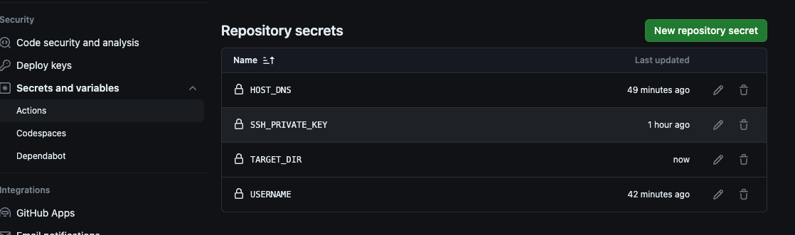

# EC2-Streamlit-App
This is a simple project that shows how to deploy a GPT-3 app built with Streamlit on an AWS EC2 instance while also using Github Actions as CI/CD pipeline. 

<br/>


## Steps to deploying

1. Connect to your ec2 instance
    ```bash
        ssh -i "testkey.pem" ubuntu@ec2-52-202-251-189.compute-1.amazonaws.com
    ```

2. Setup python virtual environment - run these commands:
    ```bash
        apt-get update
        apt-get install python3-virtualenv
        apt install python3.10-venv 
        python3 -m venv ~/.[name] # create python VE
        source ~/.[name]/bin/activate #activate
    ```
3. git clone this repo
    ```bash
        git clone https://github.com/seunboy1/EC2-Streamlit-App.git
    ```
4. Install necessary libraries
    ```bash
        pip install -r requirements.txt
    ```
5. Permanently store your openai secret key as environment variable in ec2 
    ```bash
        vim ~/.bashrc
        export openai_key=your key
    ```
   Nt: you have to reconnect to your ec2 instance to see the changes.
6. Edit the security group of your ec2 to add an inbound rule for port 8501, since streamlit uses the 8501 port.
   
7. Run streamlit app in background
    ```bash
        nohup streamlit run app.py > nohup.out 2> nohup.err < /dev/null &
    ```
8. Check out the app
   ```bash
        http://[your public ipv4 address]:8501
        http://34.203.229.115:8501
    ```
9.  To take it a step further you can deploy it with a custom domain. Check out this [repo](https://github.com/seunboy1/Static-Website) on how to do it.

## CI/CD with Github Actions

1. Create the necessary secret in Github 
   * SSH_PRIVATE_KEY: This is your pem key file
   * REMOTE_HOST: Your public dns 
   * REMOTE_USER: Username of your ec2, usually ubuntu or ec2-user
   * TARGET: target destination of ec2 instance to clone the repo into
        
2. Next create your workflow. Sample can be found in `.github/workflows/streamlit.yaml` 
    
